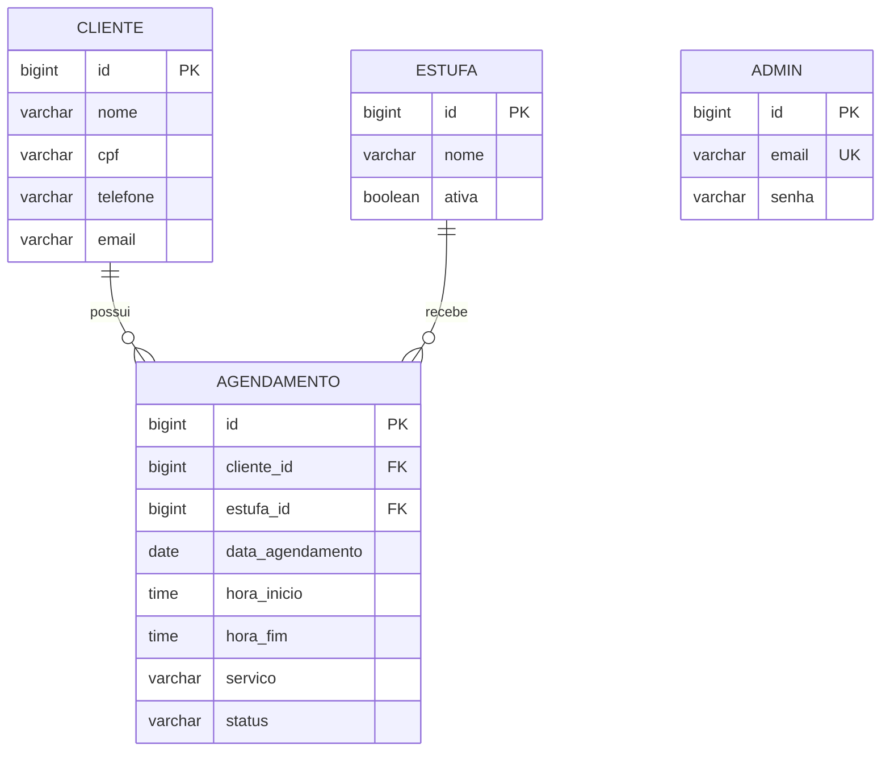

# SAEP - Sistema de Agendamento de Oficina

Sistema web para uma oficina de funilaria e pintura. Permite administrar clientes, estufas e agendamentos de serviços como preparação, martelinho de ouro e pintura.

## Tecnologias

- Backend: Java 21, Spring Boot, Spring Data JPA e Gradle.
- Banco de dados: PostgreSQL.
- Frontend: Angular 22, TypeScript, SCSS e npm.
- Testes: JUnit no backend e Vitest no frontend.

## Requisitos funcionais

- Login e logout do administrador.
- Cadastro, listagem, busca, edição e exclusão de clientes.
- Busca de clientes por nome ou CPF.
- Cadastro, listagem, edição e exclusão de estufas.
- Cadastro, listagem, edição e exclusão de agendamentos.
- Seleção de cliente, data, horário, serviço e estufa no agendamento.
- Carregamento das estufas a partir do banco de dados.
- Bloqueio de horários sobrepostos na mesma estufa e data.
- Exibição de mensagem quando um agendamento entrar em conflito.

## Requisitos não funcionais

- API REST com dados em JSON e códigos HTTP adequados.
- Persistência em PostgreSQL usando JPA.
- Interface responsiva para desktop e dispositivos móveis.
- Separação entre frontend, API, controllers, repositories e models.
- Execução local documentada e reproduzível.
- Senhas não devem ser retornadas pela API.

## Modelagem do banco



A regra de conflito considera dois agendamentos sobrepostos quando pertencem à mesma estufa e data e obedecem à condição:

```text
novo_inicio < horario_existente_fim
e novo_fim > horario_existente_inicio
```

A API retorna `409 Conflict` quando encontra uma sobreposição.

## Banco e população

O banco utilizado é `saep_agendamento_db`. Com `spring.jpa.hibernate.ddl-auto=update`, o Hibernate cria ou atualiza as tabelas ao iniciar o backend.

O script [seed.sql](backend/src/main/resources/db/seed.sql) insere cinco estufas, dois clientes e um administrador de teste. Ele pode ser executado mais de uma vez sem duplicar esses registros.

Credenciais de teste:

```text
E-mail: admin@saep.com
Senha: admin123
```

### Execução do seed

1. Crie o banco `saep_agendamento_db` no PostgreSQL.
2. Inicie o backend para criar as tabelas.
3. Execute:

```powershell
psql -U postgres -d saep_agendamento_db -f backend/src/main/resources/db/seed.sql
```

O script não cria o banco e não é executado automaticamente pelo Spring.

## Endpoints principais

| Método | Endpoint | Função |
| --- | --- | --- |
| `POST` | `/api/admin/login` | Login do administrador. |
| `GET`, `POST`, `PUT`, `DELETE` | `/api/clientes` | CRUD de clientes. Busca: `?busca=nome-ou-cpf`. |
| `GET`, `POST`, `PUT`, `DELETE` | `/api/estufas` | CRUD de estufas. Busca: `?busca=nome`. |
| `GET`, `POST`, `PUT`, `DELETE` | `/api/agendamentos` | CRUD de agendamentos. Filtro: `?data=AAAA-MM-DD`. |

## Como executar

### Pré-requisitos

- JDK 21.
- PostgreSQL 14 ou superior.
- Node.js com npm 11.17 ou compatível.
- Git e navegador moderno.

### Backend

Windows:

```powershell
cd backend
.\gradlew.bat bootRun
```

Linux/macOS:

```bash
cd backend
./gradlew bootRun
```

A API estará disponível em `http://localhost:8081`.

### Frontend

```powershell
cd frontend/auto-estufa
npm install
npm start
```

A aplicação estará disponível em `http://localhost:4200`.

## Testes

Backend:

```powershell
cd backend
.\gradlew.bat test
```

Frontend:

```powershell
cd frontend/auto-estufa
npm test
```

O teste de contexto do backend precisa de um PostgreSQL ativo e configurado.

Casos principais:

- Login válido e inválido.
- Cadastro e busca de cliente.
- Edição e exclusão de cliente.
- Criação de agendamento válido.
- Conflito de horário na mesma estufa.
- Agendamentos simultâneos em estufas diferentes.
- Logout.

## Infraestrutura

- Backend: porta `8081`.
- Frontend: porta `4200`.
- PostgreSQL: porta `5432`.
- Memória recomendada: 4 GB livres.
- Espaço livre recomendado: 2 GB.
- Acesso à internet para baixar dependências na primeira execução.

As credenciais do banco podem ser configuradas por `DB_URL`, `DB_USERNAME` e `DB_PASSWORD`. Os valores padrão estão em `backend/src/main/resources/application.properties`.

## Estrutura

```text
backend/              API Spring Boot, models e persistência
frontend/auto-estufa/ Aplicação Angular
atividade.md          Especificação da atividade
README.md             Documentação do projeto
```

## Status

- [x] Backend REST.
- [x] Login administrativo básico.
- [x] CRUD de clientes, estufas e agendamentos.
- [x] Validação de conflito de horários.
- [x] Frontend Angular responsivo.
- [x] Script de população do banco.
- [x] Testes unitários básicos do frontend.
- [ ] Testes de integração do backend.
- [ ] Criptografia das senhas com BCrypt.
