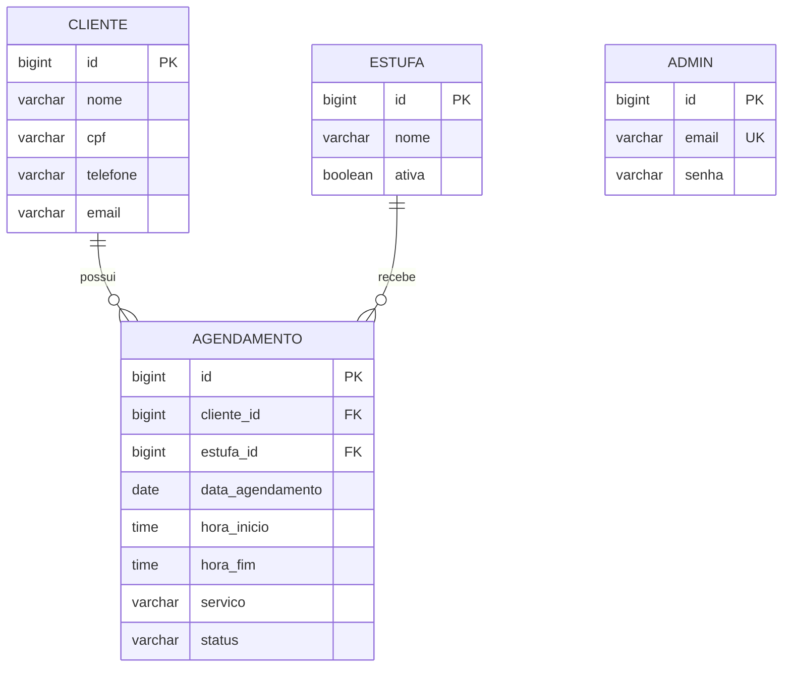

# SAEP - Sistema de Agendamento de Oficina

Sistema web para gerenciamento de uma oficina de funilaria e pintura. A aplicação permite cadastrar clientes e agendamentos de serviços, associando cada atendimento a uma estufa de pintura disponível.

## Contexto e regra principal

Os serviços previstos incluem preparação, martelinho de ouro e pintura. Um mesmo recurso não pode ser utilizado por dois carros em períodos que se sobreponham. A validação deve ocorrer no backend, mesmo que o frontend também avise o usuário, para preservar a integridade dos agendamentos.

## Tecnologias

- Backend: Java 21, Spring Boot, Spring Data JPA e Gradle.
- Banco de dados: PostgreSQL.
- Frontend: Angular 22, TypeScript, SCSS e npm.
- Testes frontend: Vitest por meio do Angular CLI.
- Testes backend: JUnit integrado ao Gradle.

## Requisitos funcionais

### Autenticação e navegação

- RF01 - Permitir que o usuário informe suas credenciais na tela de login.
- RF02 - Exibir mensagem de erro quando o login falhar.
- RF03 - Exibir o usuário autenticado na interface principal.
- RF04 - Permitir o logout e retornar à tela de login.
- RF05 - Disponibilizar acesso aos módulos de Clientes e Agendamentos.

### Clientes

- RF06 - Listar clientes em tabela ou grid.
- RF07 - Buscar clientes por nome ou CPF.
- RF08 - Cadastrar um cliente com os campos obrigatórios.
- RF09 - Editar os dados de um cliente.
- RF10 - Excluir um cliente mediante confirmação.
- RF11 - Validar campos obrigatórios e impedir o envio de dados inválidos.
- RF12 - Disponibilizar operações de criar, consultar, atualizar e excluir clientes na API REST.

### Agendamentos

- RF13 - Listar os agendamentos cadastrados.
- RF14 - Criar um agendamento informando cliente, data, hora e estufa de pintura.
- RF15 - Permitir a edição e exclusão de agendamentos.
- RF16 - Carregar as estufas disponíveis dinamicamente do banco de dados.
- RF17 - Recusar agendamento quando a estufa já estiver ocupada no período solicitado.
- RF18 - Informar ao usuário o motivo da recusa de um conflito de horário.
- RF19 - Disponibilizar operações de criar, consultar, atualizar e excluir agendamentos na API REST.

## Requisitos não funcionais

- RNF01 - A API deve seguir o padrão REST e trocar dados em JSON.
- RNF02 - A validação de conflito deve ser feita no servidor e não depender apenas da interface.
- RNF03 - Os dados devem ser persistidos em PostgreSQL usando JPA.
- RNF04 - A aplicação deve validar entradas obrigatórias e tratar erros sem expor detalhes internos.
- RNF05 - A interface deve funcionar em navegadores modernos e adaptar-se a telas de diferentes tamanhos.
- RNF06 - A senha e as credenciais não devem ser exibidas em mensagens, logs ou respostas da API.
- RNF07 - O código deve ser organizado por responsabilidades, com separação entre interface, API e persistência.
- RNF08 - O projeto deve permitir execução local reproduzível a partir das instruções deste documento.
- RNF09 - O backend deve responder com códigos HTTP adequados, como `200`, `201`, `400`, `404` e `409`.
- RNF10 - Os testes devem cobrir validações, operações principais e a regra de conflito de agendamento.

## Modelagem do banco de dados

### Diagrama entidade-relacionamento



### Entidades e regras

| Entidade | Finalidade | Regras principais |
| --- | --- | --- |
| `cliente` | Armazena os clientes da oficina. | `cpf` e `nome` são obrigatórios no formulário do frontend. |
| `estufa` | Representa os recursos de pintura. | `nome` identifica a estufa. O frontend oferece apenas estufas ativas para novos agendamentos; a API ainda deve reforçar essa regra para chamadas diretas. |
| `agendamento` | Registra o serviço reservado. | Deve referenciar um cliente e uma estufa existentes; data, horários e serviço são obrigatórios. |
| `admin` | Armazena a credencial de acesso administrativo. | `email` é obrigatório e único; a senha é obrigatória. |

O conflito ocorre quando dois agendamentos da mesma estufa e da mesma data possuem intervalos sobrepostos. A API já valida essa condição e retorna `409 Conflict`. Considerando intervalos semiabertos, a condição é:

```text
novo_inicio < agendamento_existente.fim
e novo_fim > agendamento_existente.inicio
```

Em uma evolução futura, a operação de criação/alteração deve ser transacional para reduzir a possibilidade de reservas concorrentes.

## Script de banco de dados para população

O script de população está em `backend/src/main/resources/db/seed.sql`. Ele insere um administrador de teste, cinco estufas de pintura e dois clientes de exemplo. O script pode ser executado mais de uma vez sem duplicar esses registros.

Credenciais de teste criadas pelo script:

```text
E-mail: admin@saep.com
Senha: admin123
```

O projeto usa `spring.jpa.hibernate.ddl-auto=update` durante o desenvolvimento. Por isso, o Hibernate cria ou atualiza as tabelas a partir dos models quando o backend é iniciado. O `seed.sql` não é executado automaticamente; isso evita inserir dados de teste de forma inesperada a cada inicialização.

Para usar a carga inicial:

1. Crie o banco vazio `saep_agendamento_db` no PostgreSQL.
2. Inicie o backend uma vez para o Hibernate criar ou atualizar as tabelas `admin`, `cliente`, `estufa` e `agendamento`.
3. Execute o script no banco `saep_agendamento_db` usando pgAdmin, DBeaver ou o `psql`:

```powershell
psql -U postgres -d saep_agendamento_db -f backend/src/main/resources/db/seed.sql
```

O script de população não substitui a criação do banco. O banco precisa existir antes da inicialização do backend.

## Endpoints principais

| Método | Endpoint | Finalidade |
| --- | --- | --- |
| `POST` | `/api/admin/login` | Autenticar o administrador. |
| `GET`, `POST`, `PUT`, `DELETE` | `/api/clientes` | CRUD de clientes. Use `?busca=nome-ou-cpf` no `GET`. |
| `GET`, `POST`, `PUT`, `DELETE` | `/api/estufas` | CRUD de estufas. Use `?busca=nome` no `GET`. |
| `GET`, `POST`, `PUT`, `DELETE` | `/api/agendamentos` | CRUD de agendamentos. Use `?data=AAAA-MM-DD` no `GET`. |

O cadastro de agendamento recebe os IDs do cliente e da estufa no corpo da requisição. A API retorna `409 Conflict` quando detecta sobreposição de horários na mesma estufa e data.

## Como executar o projeto

### Pré-requisitos locais

1. Crie um banco PostgreSQL chamado `saep_agendamento_db`.
2. Configure a URL, usuário e senha do banco em `backend/src/main/resources/application.properties` ou por variáveis de ambiente.
3. Instale Java 21 e npm 11.17 ou versão compatível.

### Backend

No Windows:

```powershell
cd backend
.\gradlew.bat bootRun
```

No Linux/macOS:

```bash
cd backend
./gradlew bootRun
```

### Frontend

Em outro terminal:

```bash
cd frontend/auto-estufa
npm install
npm start
```

Depois, acesse `http://localhost:4200/`.

## Documentação de testes de software

### Testes automatizados

Backend:

```powershell
cd backend
.\gradlew.bat test
```

Frontend:

```powershell
cd frontend/auto-estufa
npm test
```

O comando do frontend executa os testes unitários configurados pelo Angular CLI/Vitest. O comando do backend executa os testes JUnit configurados no Gradle.

O teste de contexto do backend precisa de um PostgreSQL acessível com as credenciais configuradas em `application.properties`.

### Casos de teste recomendados

| ID | Cenário | Resultado esperado |
| --- | --- | --- |
| CT01 | Fazer login com credenciais válidas. | Usuário autenticado e tela principal exibida. |
| CT02 | Fazer login com credenciais inválidas. | Mensagem de erro exibida sem entrar no sistema. |
| CT03 | Cadastrar cliente sem nome ou CPF. | Formulário bloqueia o envio e informa os campos obrigatórios. |
| CT04 | Buscar cliente por nome ou CPF. | Apenas os registros correspondentes são exibidos. |
| CT05 | Editar e excluir um cliente existente. | Alteração persistida; exclusão removida após confirmação. |
| CT06 | Criar agendamento com cliente, data, hora e estufa válidos. | Agendamento criado e exibido na listagem. |
| CT07 | Criar dois agendamentos sobrepostos para a mesma estufa e data. | Segundo agendamento recusado com alerta e resposta HTTP `409`. |
| CT08 | Criar agendamentos no mesmo horário em estufas diferentes. | Ambos são aceitos. |
| CT09 | Tentar agendar usando estufa inexistente. | Operação recusada com erro de validação. |
| CT10 | Fazer logout. | Sessão encerrada e usuário encaminhado para o login. |

Para cada caso, registrar pré-condições, dados usados, passos executados, resultado obtido e resultado esperado. Os testes de conflito devem cobrir também o limite do intervalo: um agendamento que começa exatamente no horário final de outro não deve ser considerado sobreposto.

## Requisitos de infraestrutura

### Desenvolvimento

- Computador com Windows 10/11, Linux ou macOS.
- Java Development Kit (JDK) 21.
- PostgreSQL 14 ou superior, com serviço ativo e permissão para criar o banco.
- Node.js compatível com npm 11.17.
- Git para versionamento.
- Navegador moderno com suporte a TypeScript compilado e APIs web atuais.
- Pelo menos 4 GB de RAM disponíveis e 2 GB de espaço livre para dependências e build.
- Acesso à internet na primeira instalação para baixar dependências Gradle e npm.

### Execução da aplicação

- Backend com porta HTTP disponível, normalmente `8081`.
- Frontend Angular com porta de desenvolvimento disponível, normalmente `4200`.
- PostgreSQL com porta disponível, normalmente `5432`.
- Usuário do banco com permissões de conexão, criação/alteração de tabelas e leitura/escrita nas tabelas da aplicação.
- Configuração externa das credenciais do banco em ambientes compartilhados ou de produção.
- Rotina de backup do banco e armazenamento seguro dos logs em produção.

## Estrutura do projeto

```text
backend/                  API Spring Boot e persistência
frontend/auto-estufa/     Aplicação Angular
atividade.md              Especificação da atividade
README.md                 Documentação do projeto
```

## Status da entrega

- [x] Requisitos funcionais e não funcionais documentados.
- [x] Modelagem inicial do banco documentada.
- [x] Script de população com dados iniciais.
- [x] Procedimentos e casos de teste documentados.
- [x] Requisitos de infraestrutura documentados.
- [x] Interface Angular com login, dashboard, clientes e agendamentos.
- [ ] Testes de integração do backend e autenticação segura com senha criptografada.
